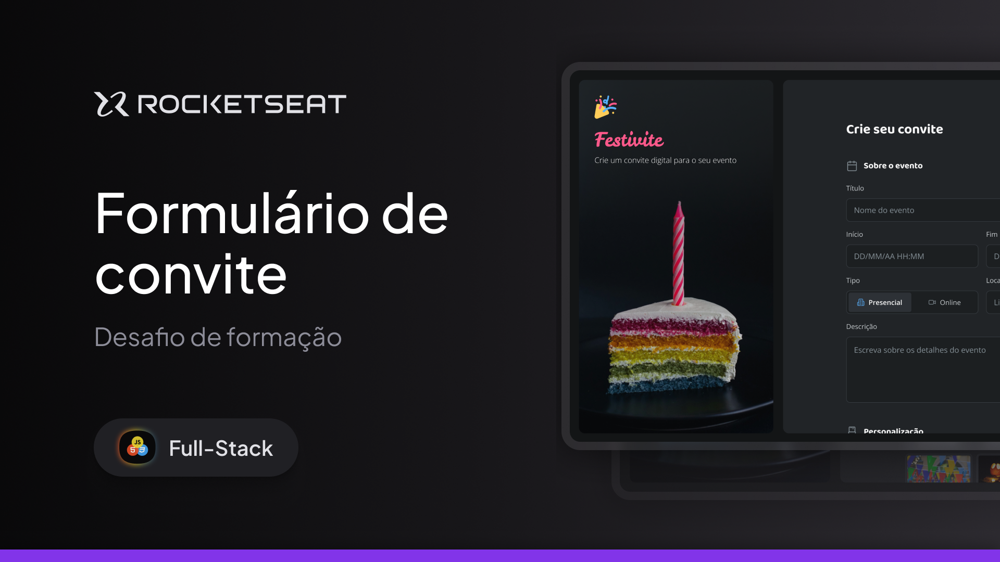

# 🎉 Festivite

> Desafio prático da formação Fullstack da Rocketseat

## 🖼️ Prévia do Projeto



---

## 💼 Sobre o Projeto

O **Festivite** é uma aplicação web responsiva para criação de convites digitais personalizados. O projeto foi desenvolvido com foco no treinamento de formulários HTML, validações e interface responsiva.

**Nota:** Este é um projeto educacional - o formulário é apenas ilustrativo e não possui funcionalidades de backend.

## 🎯 Objetivo

Treinar e aprimorar habilidades em:

- Criação e estruturação de formulários HTML
- Validação de campos obrigatórios
- Design responsivo
- Experiência do usuário (UX)
- Organização de código CSS

## ⚡ Funcionalidades

- ✅ Formulário completo para criação de convites
- ✅ Campos para informações do evento (título, data, local, descrição)
- ✅ Opções de personalização (cores, temas, estilo)
- ✅ Upload de foto de capa
- ✅ Dados de contato do organizador
- ✅ Checkboxes para termos e condições
- ✅ Design totalmente responsivo
- ✅ Interface moderna e intuitiva

---

## 🚀 Tecnologias

Este projeto foi desenvolvido utilizando:

- **HTML5**: Estrutura e semântica
- **CSS3**: Estilização e responsividade
- **JavaScript**: Interações básicas

---

## 💻 Como Executar

1. Clone o repositório:

```bash
git clone [url-do-repositorio]
```

2. Navegue até o diretório do projeto:

```bash
cd festivite
```

3. Abra o arquivo `index.html` em seu navegador preferido.

---

## 🎯 Aprendizados

Durante o desenvolvimento deste projeto, foram praticados:

- Estruturação de formulários complexos
- Uso de diferentes tipos de input (text, email, tel, datetime-local, file, etc.)
- Implementação de radio buttons e checkboxes personalizados
- Validação básica de campos obrigatórios
- Upload de arquivos com drag and drop
- CSS Grid e Flexbox para layouts responsivos
- Organização de código CSS com variáveis customizadas

---

### 👨‍💻 Autor

Desenvolvido por Wigor.  
Projeto fictício com fins educacionais.
